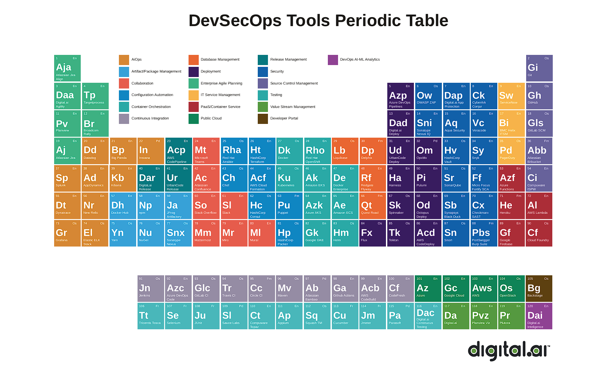

## 👋 Hi there! I'm Marjan Rafi

🎓 Electronics & Communication Engineering graduate from KUET
🏛️ Proud Notredamian -where my passion for technology and excellence first took shape

📍 Currently in Dhaka, Bangladesh | 🌍 Open to relocation roles across Europe
🔄 Shifting career into DevOps & Cloud Engineering -blending development and operations for system reliability

💡 I’m a curious, self-driven learner on a mission to build scalable, resilient, and cloud-native infrastructure
🛠️ With a strong base in OS fundamentals, version control (Git), and full-stack development
💻 Experienced with Java, JavaScript, Python, and actively applying these in real-world projects

🚧 Deep diving into:

CI/CD pipelines & automation

Kubernetes, Docker & Infrastructure as Code

System design for high availability and reliability

🎯 Vision: To grow into a world-class engineer and become FAANG-ready within the next decade through constant learning, hands-on projects, and collaboration

---

### 🔧 Tech Stack

#### 🖥️ Programming & Scripting

#### 💻 Frontend & UI

#### 🏗️ Backend & API

#### 🐳 DevOps & Cloud

#### 🔁 CI/CD & Infrastructure

#### 📊 Tools & Utilities

#### 🤖 **AI Tools**

---

### 🌱 Actively Learning & Exploring
- Advanced **system design** for production-grade systems  
- Cloud-native architectures  
- Monitoring, observability, and reliability engineering  
- Open-source contributions to DevOps and SRE tools

---

### 📌 Goals
- Contribute to open-source DevOps tooling  
- Build a strong GitHub project portfolio  
- Land a DevOps/Cloud Engineering role in 2025

---

## 📚 Blogs & Resources

### 🔥 Featured

> **[DevSecOps 2024 – Periodic Table (PDF)](https://digital.ai/wp-content/uploads/2024/04/digital-ai-periodic-table-of-devsecops-2024.pdf)**  
> A comprehensive visual breakdown of DevSecOps tools, practices & platforms.

---

📫 **Let’s Connect**:  

